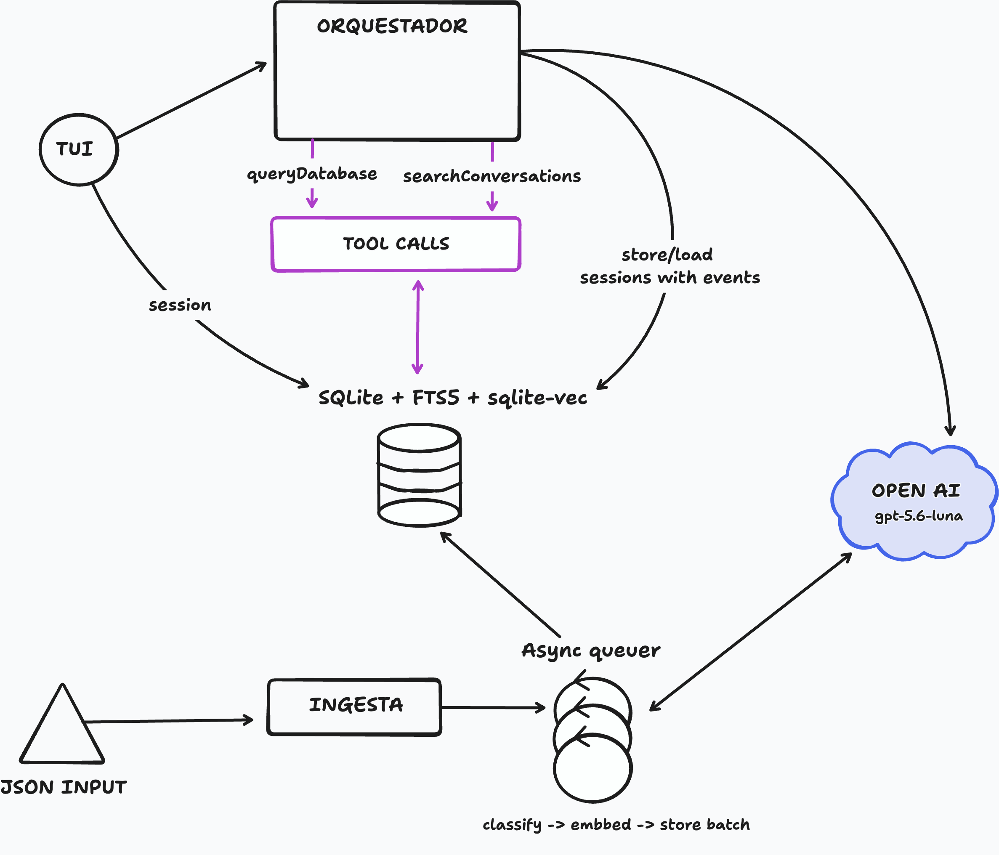

# Justificación de las decisiones de arquitectura

## 1. ¿Cómo proceso el dataset y por qué?

Elegí combinar un análisis previo del dataset con análisis al momento de responder una pregunta. La idea es pagar una vez el costo de preparar las conversaciones y reutilizar ese trabajo en las consultas posteriores, manteniendo la posibilidad de explorar preguntas que no había previsto al importar los datos.

La primera etapa empieza en [scripts/import-conversations.ts](/Users/melinajauregui/Documents/conversation-analysis-agent/scripts/import-conversations.ts), donde leo el JSON, valido su estructura y llamo a `classifyConversations`, en [src/classify-conversation.ts](/Users/melinajauregui/Documents/conversation-analysis-agent/src/classify-conversation.ts:281). Esa función organiza el procesamiento por lotes: el modelo analiza las conversaciones y devuelve etiquetas de resolución, repetición del usuario, calidad del asistente, motivos de contacto y notas. Por defecto se procesan cinco conversaciones por solicitud, con una concurrencia configurable.
Además, `getCachedConversationIds`, en el archivo de guardado, permite omitir conversaciones ya procesadas cuando coinciden el contenido y la configuración del análisis y están completos los índices requeridos. Esto permite retomar una importación sin repetir todo el trabajo anterior.

Después preparo la información para poder buscarla. `buildEmbeddingPayload`, en [src/search-documents.ts](/Users/melinajauregui/Documents/conversation-analysis-agent/src/search-documents.ts:6), prepara los textos para generar tres embeddings por conversación: uno de los motivos de contacto, otro de las notas del análisis y otro del intercambio completo. `embedClassifiedBatch` convierte esos textos en embeddings, que permiten buscar por similitud de significado. Finalmente, `saveClassifiedBatch`, en [src/save-classified-batch.ts](/Users/melinajauregui/Documents/conversation-analysis-agent/src/save-classified-batch.ts), guarda los mensajes originales, las etiquetas y los índices de búsqueda en SQLite. El guardado se hace en una transacción por lote, una vez que la clasificación y los embeddings están completos, para evitar dejar un lote parcialmente guardado.

Cuando llega una pregunta, el agente aprovecha esa preparación. `answerQuestion`, en [src/orchestrate-question.ts](/Users/melinajauregui/Documents/conversation-analysis-agent/src/orchestrate-question.ts:215), permite que el modelo consulte las etiquetas mediante SQL o busque conversaciones relevantes y analice sus mensajes. Por ejemplo, para preguntar cuántos casos quedaron sin resolver puede contar las etiquetas guardadas, para explorar qué salió mal en conversaciones sobre un tema particular puede recuperar ejemplos y leerlos. Así no necesita volver a clasificar todo el dataset en cada interacción.

Elegí este enfoque porque espero que un equipo haga muchas preguntas sobre el mismo conjunto de conversaciones. Adelantar el trabajo más costoso permite que las consultas posteriores necesiten menos procesamiento y que los conteos reutilicen las mismas clasificaciones. 

El costo de esta decisión es que hay que esperar la ingesta inicial y pagar la clasificación y los embeddings antes de empezar a consultar. También las métricas dependen de la calidad de las etiquetas: reutilizarlas hace consistentes los conteos, pero no garantiza que el modelo haya clasificado bien. Si aparece una pregunta nueva, la búsqueda permite explorar ejemplos; para obtener una métrica exhaustiva sobre una característica que no había clasificado, necesitaría una nueva pasada de análisis. Acepté esa limitación para favorecer consultas frecuentes sobre un dataset ya preparado.

**¿Cómo analizo a escala sin enviar todo el dataset en cada consulta?**

Para preguntas de cantidades, porcentajes o rankings sobre las etiquetas existentes, uso `queryDatabase`, en [src/execute-question.ts](/Users/melinajauregui/Documents/conversation-analysis-agent/src/execute-question.ts:45). Por ejemplo, si preguntan qué porcentaje de conversaciones se resolvió, SQLite calcula el total y la cantidad de casos resueltos, y el modelo recibe ese resultado. La base puede trabajar sobre todas las conversaciones sin que sus mensajes ocupen espacio en el contexto del modelo. Elegí hacer esos cálculos en SQL porque son operaciones que la base puede resolver directamente, sin volver a pagar una interpretación de cada conversación.

Para preguntas que requieren leer contenido, uso `searchConversations`, en [src/search-conversations.ts](/Users/melinajauregui/Documents/conversation-analysis-agent/src/search-conversations.ts). Combina FTS5, que busca palabras o frases concretas, con búsqueda semántica mediante sqlite-vec, que compara el embedding de la pregunta con los embeddings ya guardados. Por ejemplo, una palabra como “passkey” se puede encontrar por coincidencia textual, mientras que una descripción como “problemas para entrar sin contraseña” puede recuperar conversaciones por similitud de significado. En esta etapa solo genero el embedding de la consulta, los embeddings de las conversaciones se reutilizan.

Dentro de ese mismo archivo, `combineRankings` combina las posiciones de ambos resultados y selecciona las conversaciones mejor ubicadas. Después, `attachConversationMessages` incorpora sus mensajes originales para que el modelo pueda revisar la evidencia. La tool recomienda devolver diez conversaciones y permite hasta cien por llamada. Así reduzco el texto que recibe el modelo y conservo el intercambio original para interpretar qué pasó, en lugar de depender únicamente de las notas generadas durante la clasificación.

También puse límites al trabajo por pregunta. El orquestador permite seis llamadas a herramientas por defecto, y las consultas SQL tienen límites de tiempo y tamaño de respuesta definidos en [src/sql-policy.ts](/Users/melinajauregui/Documents/conversation-analysis-agent/src/sql-policy.ts:17). Eso acota cada consulta, aunque todavía hay una limitación: la búsqueda devuelve los mensajes completos de las conversaciones seleccionadas y el historial de sesión se vuelve a enviar al modelo.
Es una limitación de la implementación actual. En un sistema real debería compactar ese historial o limitarlo a los últimos X mensajes, conservando un resumen del contexto relevante para poder responder las preguntas de seguimiento. 

La cobertura depende del camino que elija el modelo. Puede consultar todo el dataset mediante SQL para calcular métricas sobre las clasificaciones guardadas. Si necesita analizar una característica nueva, también puede consultar los mensajes por SQL y recorrerlos por páginas para buscar una cobertura total, siempre que alcance el presupuesto de llamadas y de contexto disponible. La búsqueda híbrida ofrece una alternativa más acotada para explorar patrones y mostrar ejemplos. Elegí esta combinación para permitir distintos alcances según la pregunta; el agente debe distinguir cuándo revisó todo el dataset y cuándo sus conclusiones se apoyan solamente en los casos recuperados.

**¿Qué hace el LLM y qué hace el código?**

Uso el LLM donde hace falta interpretar lenguaje: clasificar las conversaciones durante la ingesta, entender la pregunta del usuario, elegir herramientas y explicar los hallazgos a partir de los resultados. También propone cómo agrupar motivos de contacto que expresan lo mismo con distintas palabras. Estas responsabilidades están en `classifyConversations` y `answerQuestion`, en [src/classify-conversation.ts](/Users/melinajauregui/Documents/conversation-analysis-agent/src/classify-conversation.ts) y [src/orchestrate-question.ts](/Users/melinajauregui/Documents/conversation-analysis-agent/src/orchestrate-question.ts).

El código valida las estructuras, guarda los datos, ejecuta las búsquedas y aplica los límites. Para las métricas, el modelo escribe el SQL y SQLite ejecuta los filtros, conteos y porcentajes mediante `queryDatabase`, en [src/execute-question.ts](/Users/melinajauregui/Documents/conversation-analysis-agent/src/execute-question.ts). La consulta generada se valida y restringe usando la propia librería de SQLite: en [src/sql-query-worker.ts](/Users/melinajauregui/Documents/conversation-analysis-agent/src/sql-query-worker.ts), `setAuthorizer` permite únicamente las operaciones, tablas, columnas y funciones autorizadas. Además, la conexión es de solo lectura y se admite una sola sentencia, para bloquear escrituras u otras operaciones fuera del alcance esperado. El cálculo es determinista sobre los datos guardados, aunque el modelo todavía puede elegir un filtro equivocado o partir de una etiqueta incorrecta.

El trade-off fue darle flexibilidad al modelo para escribir consultas, a cambio de implementar esos controles. La primera versión ofrecía distintas herramientas con consultas predefinidas, pero las agregaciones más complejas no se resolvían bien y mantener esas herramientas resultaba poco práctico. Seguir ese camino implicaba anticipar y escribir consultas para todos los casos que quisiera soportar, y aun así el modelo podía equivocarse al elegirlas o combinarlas. Por eso elegí SQL generado por el modelo con una ejecución restringida. En las pruebas que hice obtuve mejores resultados, porque el modelo generalizaba mejor a preguntas y agregaciones nuevas, sin tener que agregar una herramienta por cada variante.

**¿Cómo mantengo el contexto multi-turn?**

Mantengo dos tablas en SQLite: `sessions`, con el ID y la fecha de creación de cada sesión, y `session_events`, con las preguntas del usuario, las respuestas del asistente y las llamadas a herramientas con sus argumentos y resultados, ordenados por posición. Las funciones para guardar y recuperar ese estado están en [src/session.ts](/Users/melinajauregui/Documents/conversation-analysis-agent/src/session.ts). Guardo también las herramientas porque sus argumentos y resultados conservan los filtros usados y los IDs recuperados, además de la explicación que vio el usuario.

En cada pregunta, `answerQuestion` recupera el historial y `historyToResponseInput` lo convierte al formato de entrada del modelo. Así, ante “ahora solo los no resueltos”, el modelo tiene la intención anterior y los casos recuperados para continuar el análisis. Actualmente, el conjunto y los filtros se reconstruyen a partir de ese historial; no hay una tabla separada de filtros activos. El historial se envía completo, con la limitación de crecimiento mencionada antes.

Conecté este flujo a una TUI con OpenTUI en `startChat`, en [src/chat.ts](/Users/melinajauregui/Documents/conversation-analysis-agent/src/chat.ts), para tener una interfaz de chat en la terminal con mensajes, scroll y estado de procesamiento. Cada pregunta usa el mismo ID de sesión, lo que permite hacer seguimientos dentro de la misma conversación. Persistí las conversaciones con el agente en la base de datos pensando también en una futura mejora de la TUI: poder elegir una sesión anterior y reanudarla con su historial. La información necesaria ya queda guardada; falta incorporar esa opción en la interfaz.

**¿Cómo puede el usuario verificar los hallazgos del agente?**

El agente tiene instrucciones de acompañar los hallazgos sobre contenido con IDs de conversación y números de mensaje, para poder contrastarlos con el intercambio original. Para las métricas, las llamadas a herramientas y sus resultados quedan guardados en el historial, lo que permite revisar qué consulta produjo cada número.

Para evaluar la clasificación, armé un conjunto de 70 conversaciones en [data/development.json](/Users/melinajauregui/Documents/conversation-analysis-agent/data/development.json) y etiqueté cada una según mi criterio, con ayuda de un modelo. Elegí ese tamaño porque es el que puedo revisar a mano: abrir cada conversación, contrastar la etiqueta del modelo con la mía y ver si el prompt está pidiendo lo correcto. [scripts/evaluate-development.ts](/Users/melinajauregui/Documents/conversation-analysis-agent/scripts/evaluate-development.ts) compara las clasificaciones guardadas con esas referencias y genera un reporte con métricas y diferencias por caso; cuando hay desacuerdo, puedo corregir el prompt o la etiqueta. Esa es la validación que más peso le doy: no un porcentaje sobre un dataset que no podría inspeccionar, sino evidencia de que las definiciones tienen sentido en ejemplos reales. En varias pasadas de ingesta observé aproximadamente un 85% de acuerdo. Adjunto una [corrida especial de referencia](/Users/melinajauregui/Documents/conversation-analysis-agent/reports/evaluations/architecture-reference-20260908.json) sobre esas 70 conversaciones: 87,1% de acuerdo en resolución (61/70), 97,1% en repetición (68/70) y 80,0% en calidad del asistente (56/70). El acuerdo agregado entre los tres campos fue 88,1% (185/210), y en 48 de las 70 coincidieron los tres simultáneamente (68,6%). Esta corrida evalúa resolución, repetición y calidad; los motivos de contacto y las consultas del agente se evalúan por separado. Estos números no pretenden medir todo el dataset; respaldan que los criterios que después se aplican a escala fueron contrastados con una revisión humana.

También implementé [tests/development-integration.test.ts](/Users/melinajauregui/Documents/conversation-analysis-agent/tests/development-integration.test.ts) para evaluar las consultas del agente, contrastando resultados, cálculos y evidencia con los casos esperados. En las corridas que hice sobre diez escenarios, generalmente ocho pasaban todas las verificaciones. En los otros dos fallaban algunos casos o comprobaciones puntuales, no la consulta completa. Estos tests validan que el agente obtenga los resultados esperados, calcule correctamente las métricas y respalde sus respuestas con evidencia verificable.

**¿Cómo está organizada la arquitectura?**

La aplicación tiene dos flujos que comparten SQLite. La ingesta lee el dataset, clasifica las conversaciones, genera embeddings y guarda los datos. El flujo de consulta recibe una pregunta desde la TUI, recupera el historial y ejecuta el agente, que usa SQL o búsqueda híbrida para construir la respuesta. Separé clasificación, embeddings, persistencia, búsqueda, orquestación, sesiones e interfaz en módulos con responsabilidades concretas. Por ejemplo, [src/orchestrate-question.ts](/Users/melinajauregui/Documents/conversation-analysis-agent/src/orchestrate-question.ts) coordina al modelo y sus herramientas, mientras que [src/chat.ts](/Users/melinajauregui/Documents/conversation-analysis-agent/src/chat.ts) se ocupa de la interfaz. Esto permite modificar o probar una parte sin mezclarla con el resto del flujo.

**¿Por qué elegí estos componentes?**

Elegí SQLite para mantener conversaciones, etiquetas e historial en una base local, sin administrar un servidor. FTS5 y sqlite-vec permiten sumar búsqueda textual y semántica en esa misma base.

Usé TypeScript con Bun para ejecutar la aplicación y los tests en el mismo entorno. El agente está implementado directamente con el SDK de OpenAI: con dos herramientas y un ciclo de ejecución acotado, no necesitaba un framework adicional de agentes. Zod valida las entradas y las respuestas estructuradas, TanStack Pacer organiza la concurrencia de ingesta y OpenTUI resuelve la interfaz de terminal sin tener que construir una aplicación web.

La configuración actual usa `gpt-5.6-luna` con esfuerzo de razonamiento bajo para clasificación y consultas, buscando equilibrar calidad, costo y tiempo de respuesta; los tests anteriores permiten evaluar esa elección. Para los embeddings uso `text-embedding-3-small`. Ambos modelos son configurables, de modo que puedo comparar alternativas sin cambiar la arquitectura. Las configuraciones están en [src/classify-conversation.ts](/Users/melinajauregui/Documents/conversation-analysis-agent/src/classify-conversation.ts), [src/orchestrate-question.ts](/Users/melinajauregui/Documents/conversation-analysis-agent/src/orchestrate-question.ts) y [src/embed-documents.ts](/Users/melinajauregui/Documents/conversation-analysis-agent/src/embed-documents.ts).

**¿Qué sacrifico y cuáles son los límites?**

La implementación también está ajustada a la API de OpenAI. Por cuestiones de tiempo elegí un proveedor que ya conocía y que permitía resolver tanto las llamadas al modelo como la generación de embeddings. Los tests y las evaluaciones se hicieron sobre este mismo proveedor. Integrar otro requeriría adaptar las llamadas, las herramientas y el manejo de respuestas, y volver a validar los resultados; si cambiara el modelo de embeddings, también tendría que regenerar los vectores del dataset.

Como mencioné anteriormente, dejé que el modelo genere las consultas SQL porque, con herramientas de consultas predefinidas, no generalizaba bien a preguntas nuevas. Además, cubrir más variantes volvía el código complejo y difícil de mantener y extender. Al pasar a SQL generado por el modelo con ejecución restringida, los resultados de los tests mejoraron considerablemente, especialmente en las consultas de tópicos y agrupaciones en general. El trade-off fue implementar controles sobre el SQL a cambio de una mayor flexibilidad y una menor cantidad de herramientas específicas.

También consideré la [Batch API de OpenAI](https://help.openai.com/en/articles/9197833-batch-api-faq), que ofrece un 50% de descuento frente a las llamadas síncronas y límites de uso separados, con una ventana de procesamiento de hasta 24 horas. No elimina los límites, pero evita consumir el cupo de las llamadas síncronas. Como el objetivo era procesar unas 5.000 conversaciones, prioricé obtener los resultados pronto: en mis mediciones, la ingesta concurrente con manejo de errores 429 y reintentos completaba el trabajo en mucho menos tiempo que esa ventana de un día. Elegí pagar el costo de las llamadas síncronas para tener una ingesta más inmediata; para cargas grandes sin urgencia, Batch API sería una alternativa para reducir costos.

El principal trade-off es dedicar tiempo y costo a clasificar y generar embeddings durante la ingesta para después responder consultas con menos procesamiento. Las etiquetas de resolución, repetición y calidad permiten comparar y contar con criterios estables; si quiero medir otra característica en todo el dataset, necesito analizarla también. Los motivos de contacto quedan como descripciones libres, lo que conserva matices pero requiere agruparlos por significado para obtener tópicos.

La búsqueda híbrida reduce el costo de explorar contenido al recuperar conversaciones relevantes, aunque esa selección no garantiza cobertura total. Para un análisis exhaustivo, el agente puede recurrir a SQL; si necesita leer todos los mensajes, aumentan el costo y el contexto necesarios. Por eso limito las llamadas a herramientas y el tamaño y tiempo de las respuestas SQL. Esos límites mantienen acotada la ejecución, pero pueden requerir dividir un análisis amplio en varias etapas.

También prioricé una aplicación local con SQLite y TUI, simple de ejecutar y mantener para este volumen. Un servicio compartido con muchos usuarios requeriría revisar la concurrencia y el despliegue. El historial hoy se conserva y se envía completo al modelo: para sesiones largas falta compactarlo o limitarlo a los últimos X mensajes. Además, las conversaciones que superan el límite de entrada de embeddings requieren fragmentación, que todavía no está implementada.

**¿Qué cambiaría con 5.000.000 de conversaciones?**

Con ese volumen, los principales cuellos de botella serían el procesamiento, la búsqueda vectorial y la concurrencia de lecturas y escrituras. Mantendría la separación entre ingesta y consultas, pero distribuiría el trabajo y dejaría de depender de una única aplicación con una base local.

- **Almacenamiento:** migraría los datos relacionales a PostgreSQL para gestionar múltiples workers y usuarios concurrentes, con operaciones de respaldo y recuperación propias de un servicio compartido. El motivo no sería que SQLite no pueda almacenar cinco millones de filas, sino la necesidad de coordinar escrituras y escalar la operación. 
- **Búsqueda vectorial:** usaría una base vectorial con índices de vecinos aproximados y filtros por metadatos. Con tres embeddings por conversación, cinco millones de conversaciones implican al menos quince millones de vectores, y más si fragmento los intercambios largos. Buscaría candidatos dentro del dataset, período o segmento solicitado para reducir trabajo y mejorar la relevancia.
- **Procesamiento con Batch API:** para la carga inicial y los reprocesamientos sin urgencia, aprovecharía el descuento de Batch API y sus límites separados, aceptando la ventana de hasta 24 horas. Separaría la clasificación de la generación de embeddings y persistiría los identificadores y estados de cada trabajo para recuperar sus resultados sin depender de que un proceso permanezca activo.
- **Ingesta con workers y mensajería:** leería el dataset por partes y publicaría trabajos en un sistema como Kafka, consumidos por varios workers. Una cola durable permite absorber picos, repartir la carga y retomar el procesamiento tras una caída. Kafka por sí solo no garantiza que todo termine bien: registraría el estado de cada conversación, confirmaría el trabajo después de guardar los resultados y usaría operaciones idempotentes para que una entrega repetida no duplique datos. Agregaría reintentos, una cola de fallos para revisión y una reconciliación entre conversaciones recibidas y completadas para detectar faltantes. Ajustaría la cantidad de workers a los límites de la API y de la base.
- **Subagentes para análisis amplios:** un coordinador podría dividir una pregunta compleja por temas, períodos o grupos de conversaciones y asignar cada parte a un subagente con un presupuesto acotado. Cada uno devolvería resultados estructurados y evidencia; el coordinador los consolidaría. Mantendría los conteos y porcentajes en SQL, con conjuntos y denominadores explícitos para evitar duplicar casos al combinar resultados.
- **Resultados intermedios persistidos:** guardaría selecciones de IDs, filtros y avances por análisis. Usaría tablas de trabajo o archivos en almacenamiento de objetos para que distintos workers puedan compartirlos y retomar una tarea interrumpida. Las tablas temporales de una conexión servirían para pasos locales; los análisis que deban sobrevivir a una caída necesitarían persistencia durable. Esto también permitiría que un seguimiento opere sobre el conjunto anterior sin reenviar todos sus mensajes al modelo.
- **Reutilización de consultas y respuestas:** buscaría análisis anteriores antes de ejecutar uno nuevo. Reutilizaría SQL parametrizado, agrupaciones y resultados cuando coincidan la intención, los filtros, el dataset y la versión de las etiquetas. Una pregunta parecida serviría para encontrar candidatos a reutilización; verificaría esas condiciones antes de devolver una respuesta guardada. Para métricas frecuentes, agregaría vistas materializadas o tablas de agregados.
